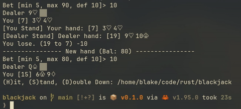

# Simple Rust CLI Blackjack game

This project is a simple CLI Blackjack game with 

- Interactive console with reactive controls (instant input rather than newline buffered)
- Play rounds of Blackjack until you run out of money
- Available actions: Hit, stand, split, double down

## How to play

### Controls
- H, Hit
- S, Stand
- X, Split
- D, Double down

### Rules

- Make a wager with your remaining balance. If you win it is returned in double, if you lose it is forfeitted.
- If, during your turn, your score exceeds 21, you lose. If the dealer's hand exceeds 21, it loses. This is called busting.
- Your score is all of the values of your cards added up with face cards being worth 10 and aces worth 11 or 1 if your score would exceed 21.
- The dealer deals 2 cards to you and then to to itself. You can only see the dealer's first card.
- If your initial hand contains a 10 score card and an ace, you get a "Blackjack" and your bet is returned 3:2 as long as the dealer doesn't also have a Blackjack.
- Based on your cards and what you can see of the dealer's hand, you have to decide what action to take.
    - Stand: End your turn
    - Hit: Take another card
    - Split: If you have 2 cards of the same value, you can split them before your first hit and play 2 separate hands with your original bet.
    - Double down: Before your first hit, you can double your bet, but you then have to take one and only one card from the deck. (Not available during a split)
- If you end your turn without having exceeded 21 points, the dealer will reveal its other card and draw cards until its score exceeds 16 (Or, if it has an ace whose score is 11, it draws until its score exceeds 17)
- Whoever has the highest score at the end without busting wins.

## Find a bug?

If you find a bug or would like to help improve the project, submit an issue on this repo. If you submit a PR, make sure to reference the issue you created.

## Dependencies and Required programs

- Rust (https://rustup.rs/)
- A terminal font that can render ♤ ♡ ♧ ♢ (not required)
